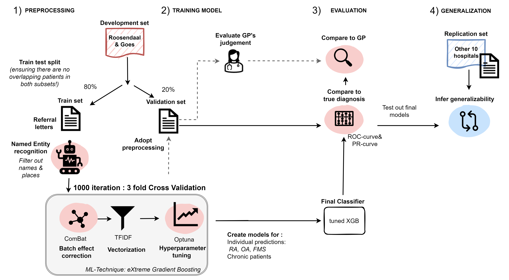

# Referral Machine Learning


## Background

It is estimated that roughly 30% of patients visiting the primary care have musculoskeletal complaints (MSK). Many of these patients are referred to the rheumatology outpatient clinic by the first healthcare provider (GP). Providing timely and appropriate care is crucial for the future prognosis of these patients, but the specific type of care needed varies depending on the diagnosis. We aimed to optimize the triaging procedure by automatically screening and prioritizing patients with AI methods. Using only the contents of the referral letters, we developed Machine Learning (ML) models to identify RA, OA, FMS and patients needing chronic care (>3 months).


## Installation


#### Windows systems:
Prerequisite: Install [Anaconda](https://www.anaconda.com/distribution/) with python version 3.6+. This additionally installs the Anaconda Prompt, which you can find in the windows search bar. Use this Anaconda prompt to run the commands mentioned below.

#### Linux / Windows (dev) systems:
Prerequisite: [conda](https://docs.conda.io/projects/conda/en/latest/user-guide/install/index.html) environment (with jupyter notebook). Use the terminal to run the commands mentioned below.

Install Jupyter Notebook:
```sh
$ conda install -c anaconda notebook
```

### Importing required modules
Before running, please install the dependencies. 

#### Option 1: create custom kernel with conda (Bash script)
prerequisite: conda3

```sh
$ bash build_kernel.sh
```

#### Option 2: pip
prerequisite: pip

```sh
$ pip install -r requirements.txt
```


## How to start
Start a notebook session in the terminal 

```sh
$ notebook
```

Which will start a notebook session in the browser from which you can inspect the notebook files.

## Pipeline of the ML project

General study flow showing the different steps of our approach.

## Citation
If you were to use this pipeline, please cite our abstract (paper is in the making): 

Maarseveen TD, Glas HK, Veris-Van Dieren J, et al. POS0587 EMPLOYING MACHINE LEARNING TO PREDICT RA DIAGNOSIS FROM REFERRAL LETTERS BY THE GENERAL PRACTITIONER. Annals of the Rheumatic Diseases 2024;83:783-784.
URL: https://ard.bmj.com/content/83/Suppl_1/783.2
DOI: 10.1136/annrheumdis-2024-eular.1728


## Contact
If you experience difficulties with implementing the pipeline or if you have any other questions feel free to send me an e-mail. You can contact me on: t.d.maarseveen@lumc.nl 
